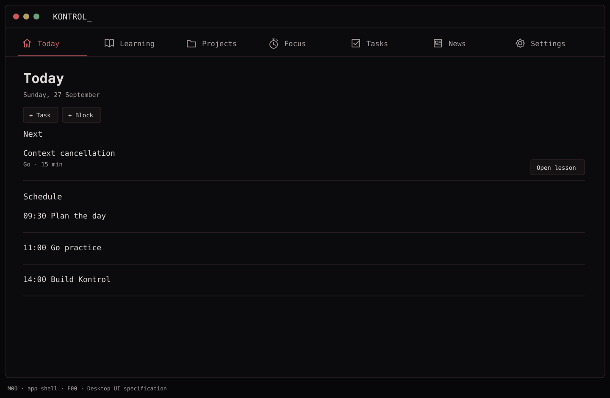
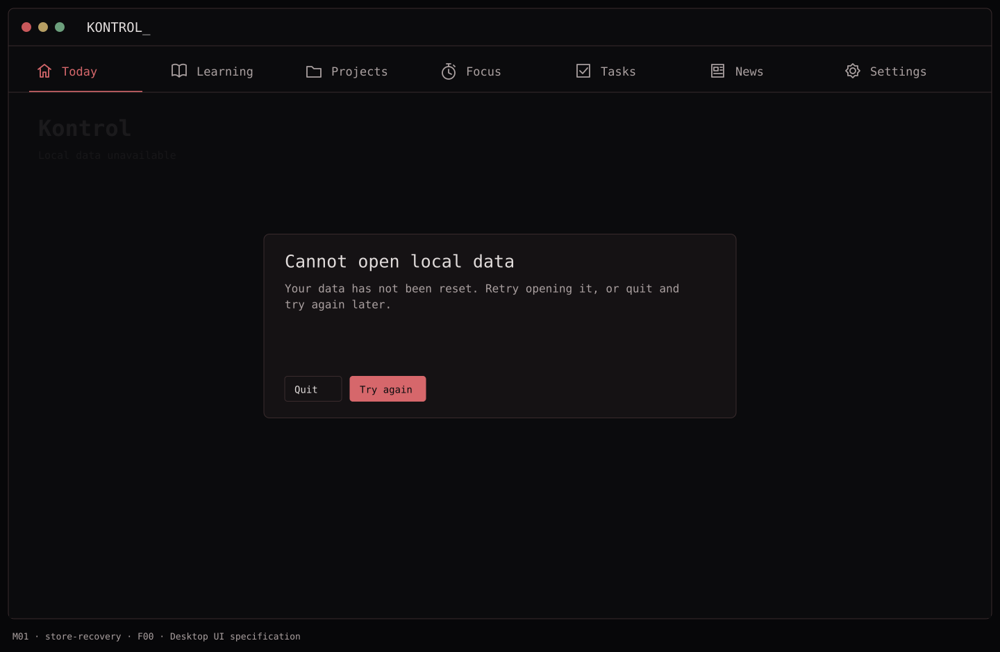

# F00 — Bootstrap and persistence

**Depends on:** none.

**Build**

- Create a macOS SwiftUI app with a horizontal icon-and-label navigation bar matching the approved mockups, the seven destinations, a Settings scene, and app-level dependency wiring.
- Set the minimum macOS version supported by all chosen APIs before implementing models; record it in the README and Xcode project. Use a single SwiftData `ModelContainer` with in-memory configuration for previews and tests.
- Add a persistent store, model migration strategy, local error reporting, and launch checks. Do not make normal launch depend on a feed or AI request.
- Seed representative, explicitly labeled sample data only in previews. The real first launch starts with useful empty states and a starter lesson catalog.

**Done when:** non-GUI startup/navigation and isolated repository-reopen tests pass without a startup network dependency.

## Function → mockup contract

| Function / page | Dedicated visual | Expected behavior |
| --- | --- | --- |
| Launch and navigation | [M00 · Today](../mockups/M00-app-shell.png) | Open the last destination; all seven sections remain reachable offline. |
| Store open, migration and failure recovery | [M01 · Kontrol](../mockups/M01-store-recovery.png) | Preserve the store on failure; retry or quit without resetting user data. |

## Implementation checklist

- [ ] Create one macOS 14+ app target and one test target; record the deployment target and selected Xcode version.
- [ ] Create feature folders and dependency wiring; show the chosen horizontal navigation. NavigationSplitView is optional inside Projects and Learning only.
- [ ] Introduce VersionedSchema V1, explicit ModelConfiguration and a ModelContainer factory. Preview stores are in-memory.
- [ ] Load bundled catalog once by catalog version; upsert definitions without changing progress.
- [ ] Route store-open failures to M01; no delete-and-recreate fallback. Log scrubbed errors and retain failed store files.

## Non-interactive acceptance checks

Follow [AGENTS.md](../../AGENTS.md). Use isolated stores/services and source review; no accessibility, keyboard, hosted UI or live-app validation.

- [ ] Isolated startup dependencies initialize without network requests; shell wiring compiles.
- [ ] Repository reopen preserves tasks; destination preference restoration passes non-GUI tests.
- [ ] An injected store failure displays M01 and leaves the store bytes unchanged.

## Visual references

[Back to PLAN](../../PLAN.md) · [All screens](../mockups/INDEX.md) · [Data contracts](../architecture.md)
