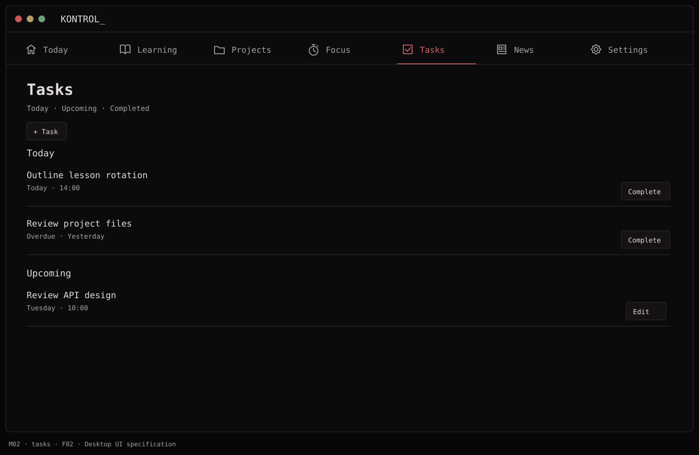
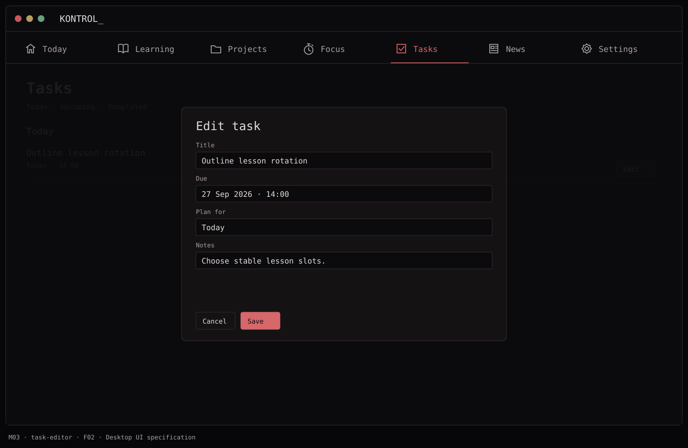
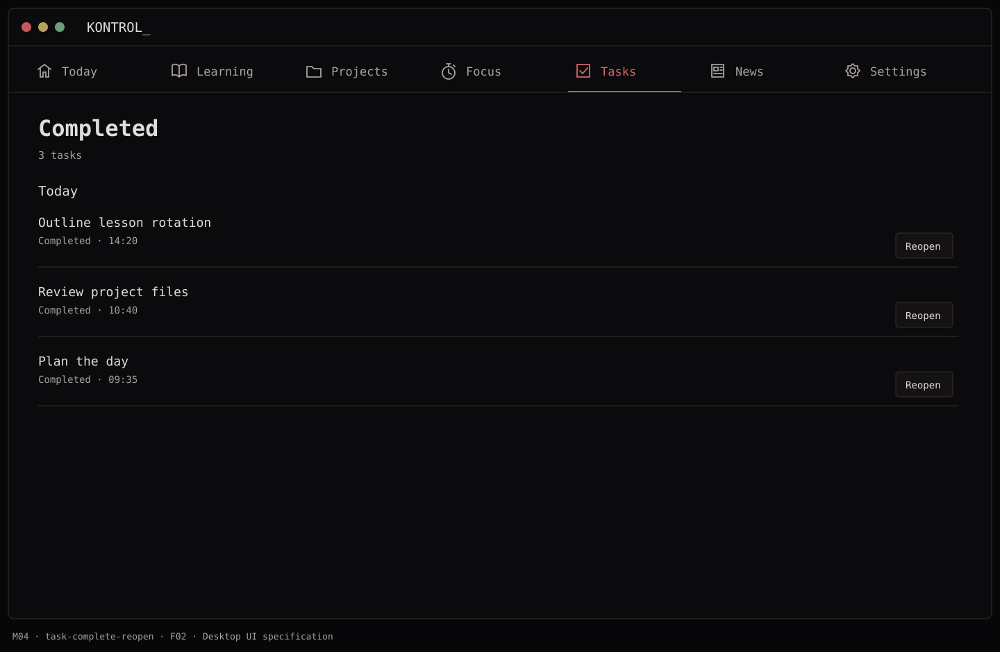
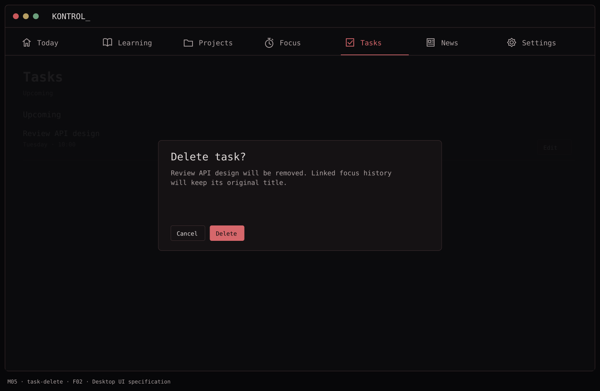
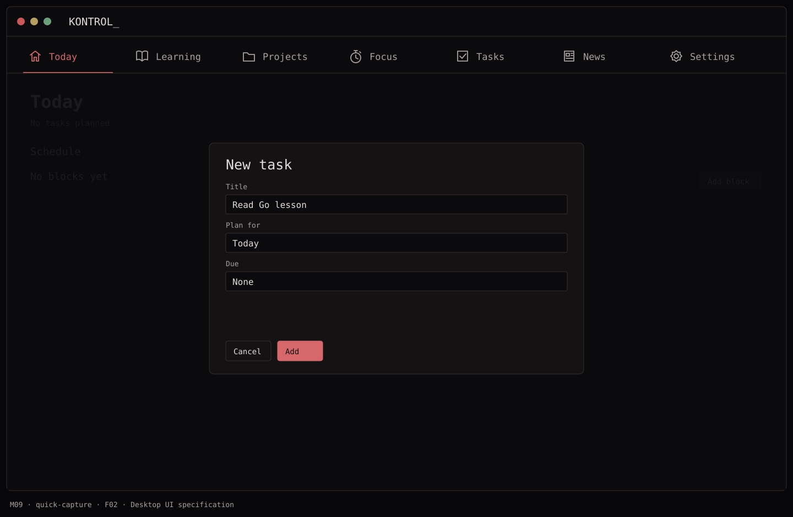

# F02 — Tasks and quick capture

**Depends on:** F00, F01.

**Data:** `Task(id, title, notes?, dueAt?, status, createdAt, completedAt?)`.

**Build**

- Add, edit, complete/reopen, and delete a personal task; allow optional due date and notes. Keep task entry short and fast.
- Show `Today`, `Upcoming`, and `Completed` task views. Quick capture on Today creates the same task model.
- Sort open tasks by due time, then creation time; persist stable IDs. Task completion updates Today immediately.
- Do not auto-create tasks from project feature files or learning lessons in V1.

**Done when:** a captured task can be found, edited, completed, and recovered after relaunch; overdue tasks remain visible rather than disappearing.

## Function → mockup contract

| Function / page | Dedicated visual | Expected behavior |
| --- | --- | --- |
| Browse today/upcoming and overdue tasks | [M02 · Tasks](../mockups/M02-tasks.png) | Filter one task store; overdue tasks stay visible. |
| Create or edit task, notes and due date | [M03 · Tasks](../mockups/M03-task-editor.png) | Validate a trimmed nonempty title, then save once. |
| Complete or reopen | [M04 · Completed](../mockups/M04-task-complete-reopen.png) | Toggle completion timestamps and update Today immediately. |
| Delete task | [M05 · Tasks](../mockups/M05-task-delete.png) | Confirm deletion; retain title snapshots in old focus sessions. |
| Quick capture | [M09 · Today](../mockups/M09-quick-capture.png) | Create the same task model with planned day set to Today. |

## Implementation checklist

- [ ] Persist TaskItem with UUID, title, notes, dueAt, plannedDay, plannedTimeZoneID, createdAt, completedAt.
- [ ] Separate due time from the day the user wants to work on a task. Today = planned for selected day OR due/overdue and still open.
- [ ] Use a sheet for creation/editing; cancel discards draft, save persists. Keep unfinished UI draft until the sheet is closed.
- [ ] Sort open items by overdue, due date, then createdAt and UUID; no-due tasks use creation order.
- [ ] Cascade no historical data on deletion. Optional references become nil; historical title snapshots remain.

## Acceptance checks

- [ ] Whitespace-only titles cannot save.
- [ ] Complete/reopen survives relaunch and updates both Today and Tasks.
- [ ] Cancel editing preserves old values; delete only affects the selected task.

## Visual references

[Back to PLAN](../../PLAN.md) · [All screens](../mockups/INDEX.md) · [Data contracts](../architecture.md)
