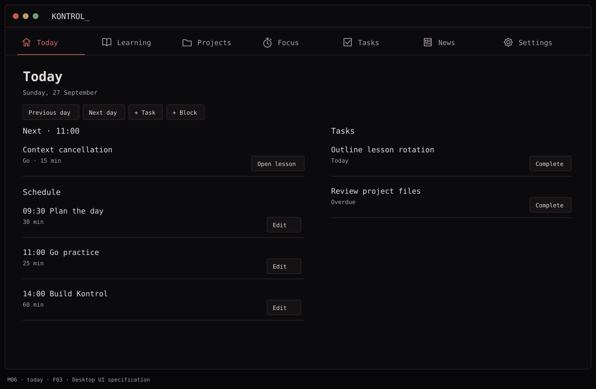
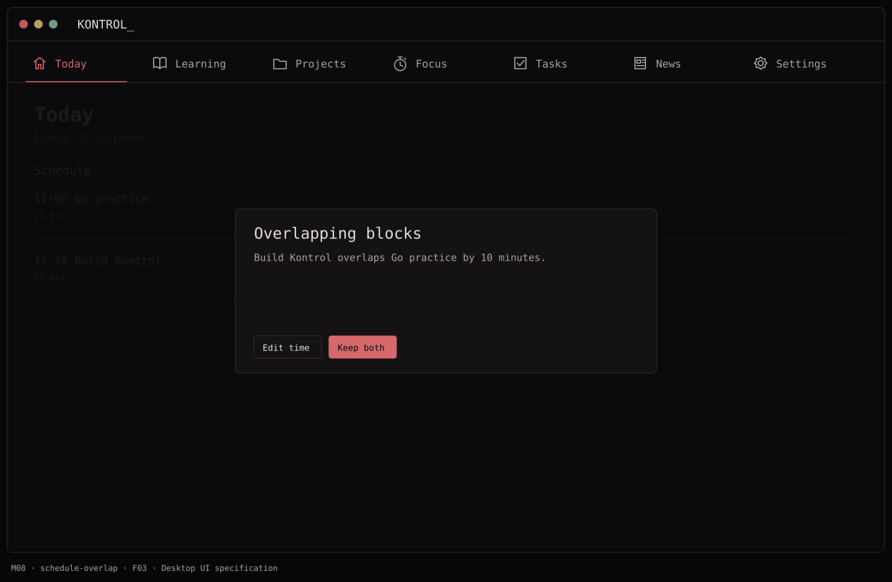

# F03 — Today and manual schedule

**Depends on:** F02. Add lesson suggestions and lesson actions after F06 is available.

**Data:** `ScheduleBlock(id, title, startAt, endAt, note?)`; references to suggested lessons stay stable by lesson ID.

**Build**

- Show the selected day, manual time blocks, and due/overdue tasks. After F06, add at most two learning suggestions drawn from active lesson slots.
- Add, move, edit, and remove manual blocks; show an overlap clearly without silently rewriting either block. Use the device's locale and time zone; store absolute timestamps.
- After F06, provide `Start now` and `Add to Today` on a lesson. The latter creates a local schedule block only after the user picks a time; no calendar event is created.
- Show a useful empty Today state and a visible path to quick capture.

**Done when:** planning and task changes survive relaunch and the selected day changes correctly across midnight/time zones. After F06, a suggested lesson also opens from Today.

## Function → mockup contract

| Function / page | Dedicated visual | Expected behavior |
| --- | --- | --- |
| Select day and open linked items | [M06 · Today](../mockups/M06-today.png) | Show schedule, due/planned tasks, and up to two active lessons. |
| Add, move, edit or delete a schedule block | [M07 · Today](../mockups/M07-schedule-editor.png) | Use the same editor for manual blocks and Add to Today. |
| Resolve overlap | [M08 · Today](../mockups/M08-schedule-overlap.png) | Offer Edit time or Keep both; never move other blocks automatically. |

## Implementation checklist

- [ ] Persist ScheduleBlock with stable id, start/end, title, note and optional lessonID; save title snapshot for missing links.
- [ ] Require end > start. Allow overnight blocks but display both dates explicitly in the editor.
- [ ] Store instants in UTC and display in the device time zone; group by the selected local day.
- [ ] Compute overlap with startA < endB and startB < endA. Touching boundaries do not overlap.
- [ ] After F06, Add to Today pre-fills title and estimated duration; saving schedules it without completing it.

## Acceptance checks

- [ ] Cross-midnight and daylight-saving boundary fixtures group correctly.
- [ ] Overlap warning leaves both originals intact until explicit save.
- [ ] Completing a lesson refreshes suggestions without removing a manually scheduled block.

## Visual references

[Back to PLAN](../../PLAN.md) · [All screens](../mockups/INDEX.md) · [Data contracts](../architecture.md)
