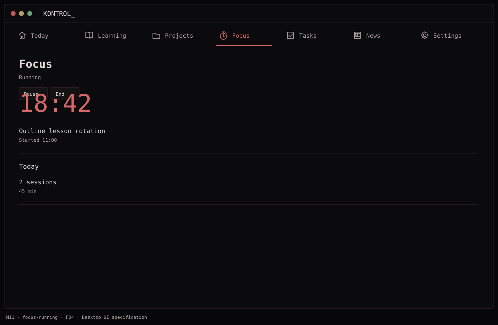
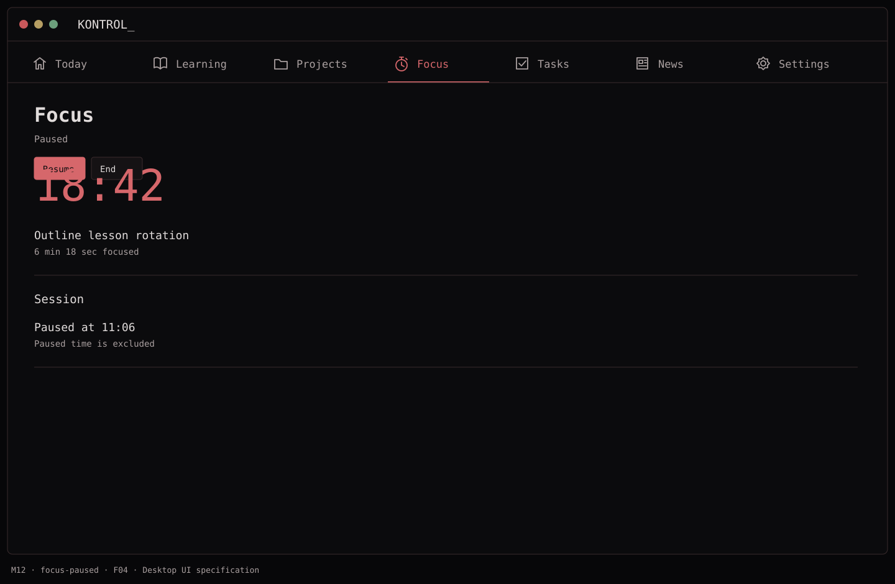
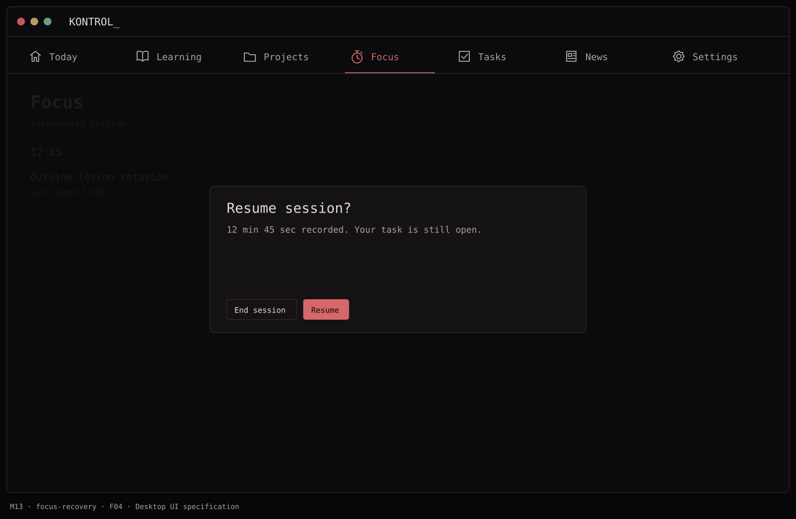
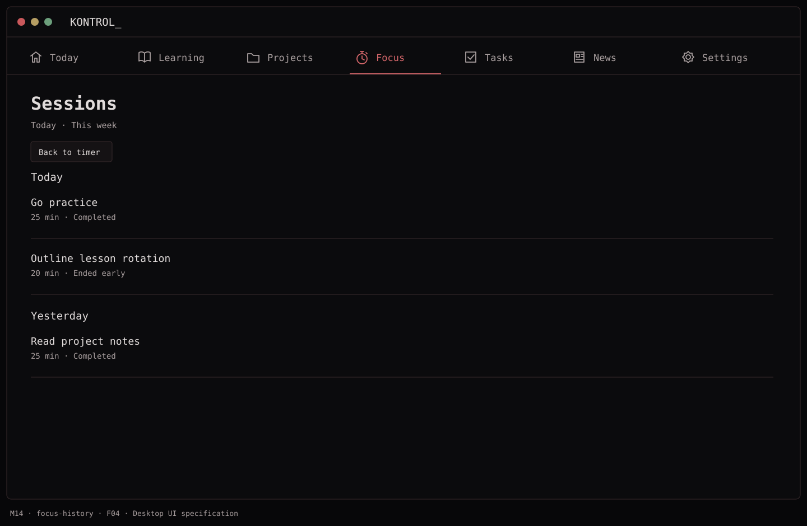

# F04 — Focus sessions

**Depends on:** F02; F03 and F06 for optional links.

**Data:** `FocusSession(id, startedAt, endedAt?, plannedSeconds, actualSeconds, state, taskId?, lessonId?)`.

**Build**

- Start a 25-minute default countdown; allow a duration choice, pause/resume, stop, and a completed-session record.
- Optionally link a task or lesson before starting. Store wall-clock start/end so reopening the app does not invent elapsed time; recover an interrupted session with a clear resume/end choice.
- Show recent sessions and today's total minutes. A session never auto-completes its linked task or lesson.

**Done when:** timer state remains coherent after the window closes/reopens, and pause, stop, and completion record the correct duration.

## Function → mockup contract

| Function / page | Dedicated visual | Expected behavior |
| --- | --- | --- |
| Configure duration and optional link | [M10 · Focus](../mockups/M10-focus-ready.png) | Set duration before start; links are optional. |
| Run session | [M11 · Focus](../mockups/M11-focus-running.png) | Persist start/deadline and display remaining time. |
| Pause or resume | [M12 · Focus](../mockups/M12-focus-paused.png) | Exclude paused intervals from focused time. |
| Recover after relaunch | [M13 · Focus](../mockups/M13-focus-recovery.png) | Reconcile persisted state; let user resume remaining time or end. |
| End/completed session and history | [M14 · Sessions](../mockups/M14-focus-history.png) | Save actual duration once; keep task and lesson status unchanged. |

## Implementation checklist

- [ ] Model ready → running ↔ paused → completed/ended. One active session maximum.
- [ ] Persist planned duration, accumulated active seconds, segmentStart, pause state, deadline and linked title snapshot.
- [ ] Use a monotonic clock while open. On relaunch reconcile wall time, clamp to [0, planned duration], and show M13 if completion is ambiguous.
- [ ] When sleeping or quitting while running, let the planned deadline continue; never record more than the planned duration. Paused sessions stay paused.
- [ ] Handle repeated end actions idempotently. History groups by local finish date and records ended-early versus completed.

## Non-interactive acceptance checks

Follow [AGENTS.md](../../AGENTS.md). Use service calls, injected clocks and repository reopen for lifecycle contracts, not a running app, sleep/wake actions or key/button presses.

- [ ] Pause for 5 minutes does not add 5 focused minutes.
- [ ] Service recovery from reopened persisted state does not restart the countdown or duplicate a session.
- [ ] A linked task remains open after timer completion.

## Visual references

[Back to PLAN](../../PLAN.md) · [All screens](../mockups/INDEX.md) · [Data contracts](../architecture.md)
