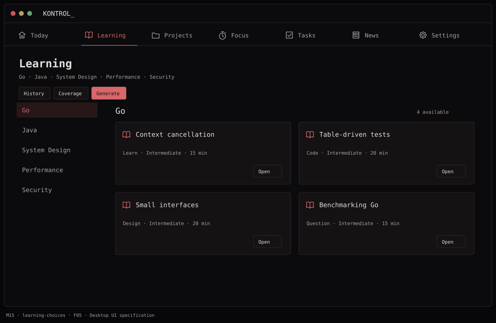

# F05 — Structured learning catalog

**Depends on:** F00, F01.

**Data contract**

```text
Topic > Subtopic > Concept > Lesson
Lesson: id, title, objective, conceptIDs[], topicID, subtopicID,
        difficulty, type, estimatedMinutes, contentVersion,
        source(seed|generated), contentFingerprint
LessonProgress: lessonID, status(available|started|completed|dismissed),
                firstShownAt?, startedAt?, completedAt?, answer?
```

**Build**

- Seed a versioned catalog for Go, Java, System Design, Performance, and Security. Give each topic enough authored lessons to fill four slots and replace completed/dismissed lessons in an initial smoke test; avoid placeholder titles with no exercise.
- Create stable concept IDs and explicit learning objectives. Keep catalog content separate from personal progress so a seed update cannot reset completion history.
- Validate prerequisite references, unique IDs, allowed types, and expected sections at build/seed import time.

**Done when:** all five topics open offline, every initial choice has actual content, and reinstalling a newer catalog preserves existing lesson progress.

## Function → mockup contract

| Function / page | Dedicated visual | Expected behavior |
| --- | --- | --- |
| Choose topic and inspect seeded lessons | [M15 · Learning](../mockups/M15-learning-choices.png) | Each topic has up to four stable active choices; definitions stay separate from user progress. |

## Implementation checklist

- [ ] Bundle 8 complete lessons per topic (40 total) across the five agreed topics; use the curriculum file in this package.
- [ ] Version definitions with stable ids. A text correction changes contentVersion but retains lesson identity.
- [ ] Validate unique ids, concept references, prerequisites, required content sections and enum values before importing.
- [ ] Make a catalog upgrader that inserts/updates definitions but never resets completion, answers, timestamps or dismissals.
- [ ] Make slot assignments persistent per topic with a unique (topicID, slotIndex) constraint.

## Acceptance checks

- [ ] All five topics display four authored choices on first launch offline.
- [ ] An updated catalog preserves completed and started progress.
- [ ] Malformed catalog fixtures are rejected before partial import.

## Visual references



[Back to PLAN](../../PLAN.md) · [All screens](../mockups/INDEX.md) · [Data contracts](../architecture.md)
