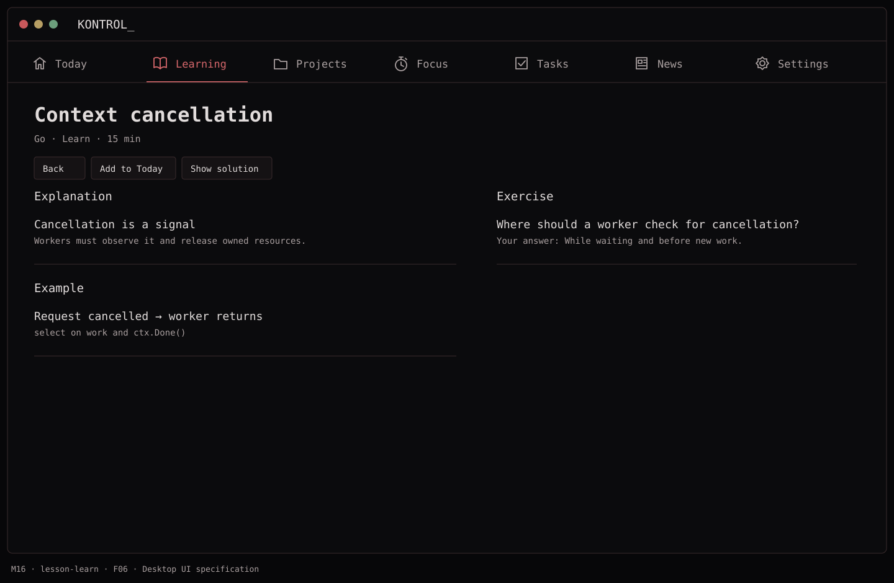
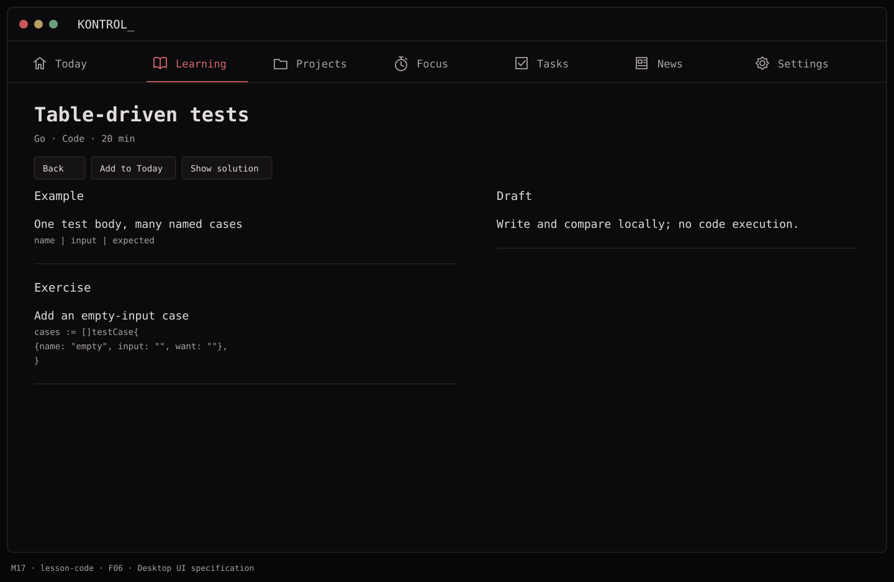
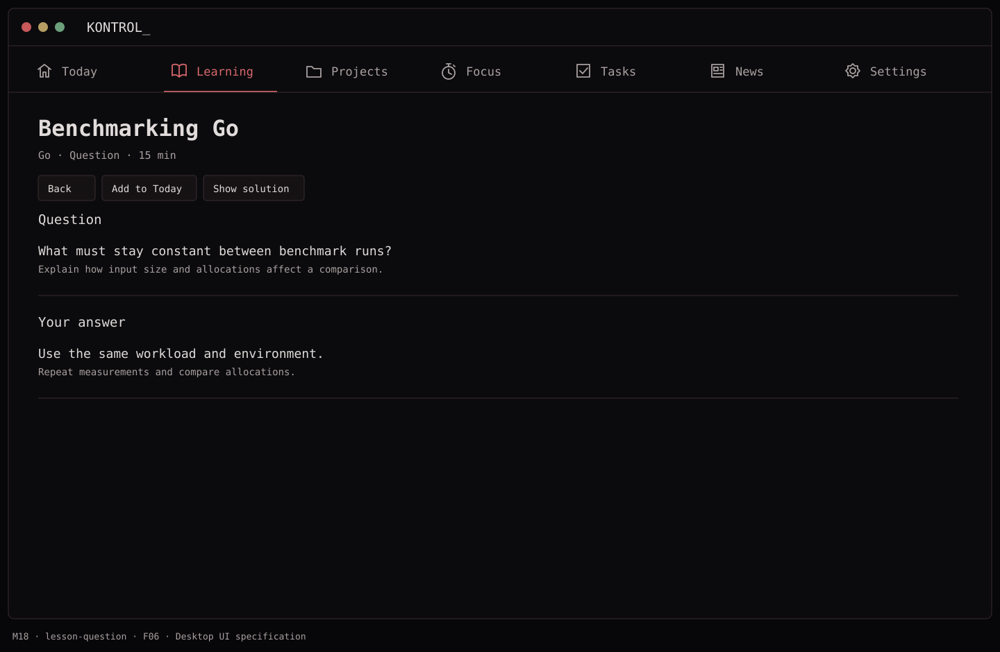
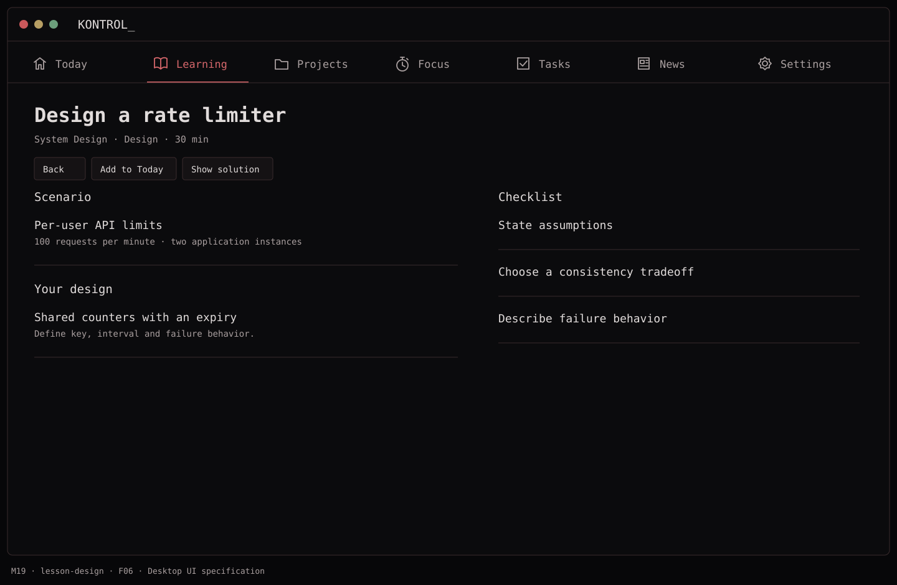
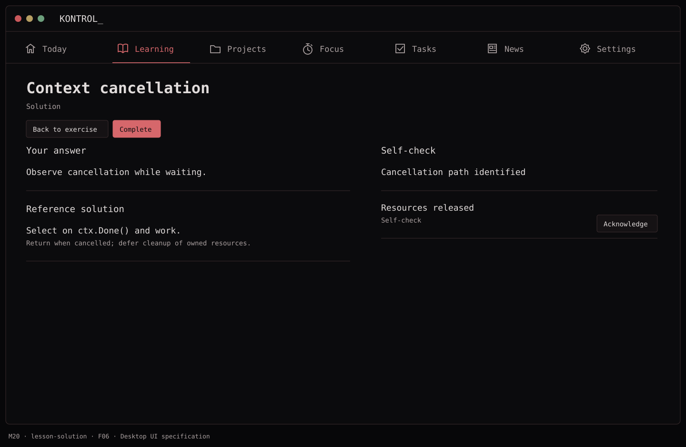
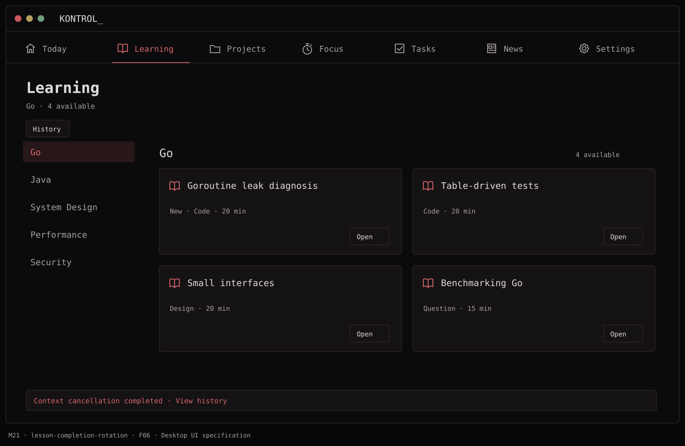
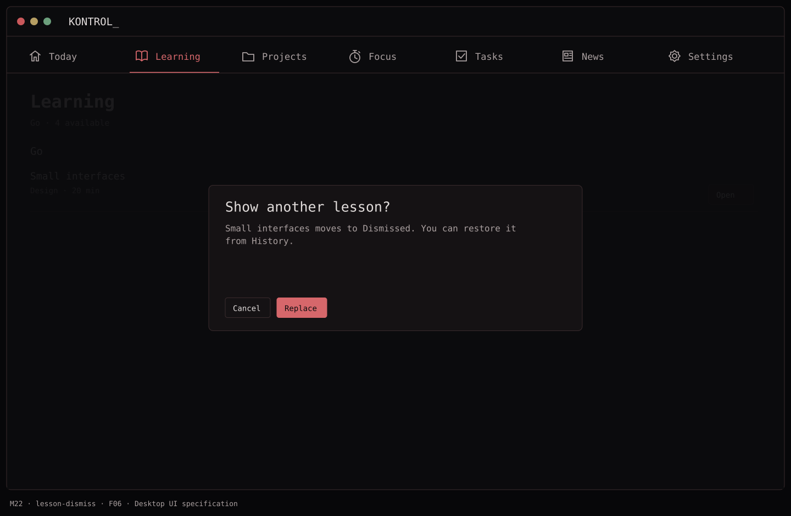
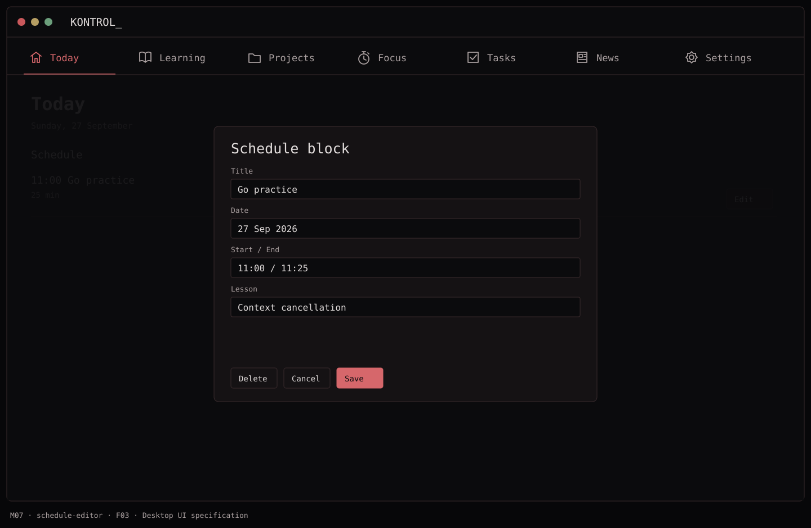

# F06 — Learning choices and lesson experience

**Depends on:** F05.

**Build**

- Show **four active lesson choices per topic** where inventory permits. They span subtopics/formats when possible and show type, difficulty, estimated time, and concept labels.
- Lesson flow: explanation → worked example → exercise → solution/explanation → explicit `Complete`. Initial formats: Learn, Code, Question, Design. For Code, show an exercise and a reference solution; V1 does not execute untrusted code. For Design, use a written prompt and self-check rubric.
- Allow `Show another`; move that exact lesson out of active choices and record it as dismissed. Keep a route back to dismissed lessons in history without counting them as completed.
- Keep started work and any typed response after navigation/relaunch. Avoid giving a completion score that implies measured mastery.

**Done when:** starting and completing a lesson updates its status, fills the empty slot with an unseen choice, and the user can resume an unfinished lesson.

## Function → mockup contract

| Function / page | Dedicated visual | Expected behavior |
| --- | --- | --- |
| Learn format | [M16 · Context cancellation](../mockups/M16-lesson-learn.png) | Explanation, worked example and answer field; resume a saved answer. |
| Code format | [M17 · Table-driven tests](../mockups/M17-lesson-code.png) | Code exercise and reference solution; no execution in V1. |
| Question format | [M18 · Benchmarking Go](../mockups/M18-lesson-question.png) | Free-text response, then compare with the reference answer. |
| Design format | [M19 · Design a rate limiter](../mockups/M19-lesson-design.png) | Scenario, constraints, design response and self-check rubric. |
| Reveal solution | [M20 · Context cancellation](../mockups/M20-lesson-solution.png) | Explicit reveal preserves the response; completion is self-reported. |
| Complete and refill a slot | [M21 · Learning](../mockups/M21-lesson-completion-rotation.png) | One transaction records completion and replaces only that slot. |
| Dismiss and replace | [M22 · Learning](../mockups/M22-lesson-dismiss.png) | Record dismissal separately; retain it in history. |
| Add lesson to Today | [M07 · Today](../mockups/M07-schedule-editor.png) | Pre-fill a block; do not create a task automatically. |

## Implementation checklist

- [ ] Render structured lesson sections rather than unrestricted generated HTML.
- [ ] Autosave draft responses on a short debounce and on navigation; retain the contentVersion used by the attempt.
- [ ] Enable Complete after solution reveal and a self-check acknowledgement; do not call it an assessment score.
- [ ] Prevent double completion; use unique lessonID progress and a transaction for completion plus slot assignment.
- [ ] If no eligible candidate exists, show fewer slots and an explicit Generate option; never repeat a completed lesson as a filler.

## Acceptance checks

- [ ] Every format opens and resumes offline.
- [ ] Completion changes one slot and creates one history record even on repeated clicks.
- [ ] Dismissing records no completion; restored dismissal is eligible again only by explicit action.

## Visual references

[Back to PLAN](../../PLAN.md) · [All screens](../mockups/INDEX.md) · [Data contracts](../architecture.md)
