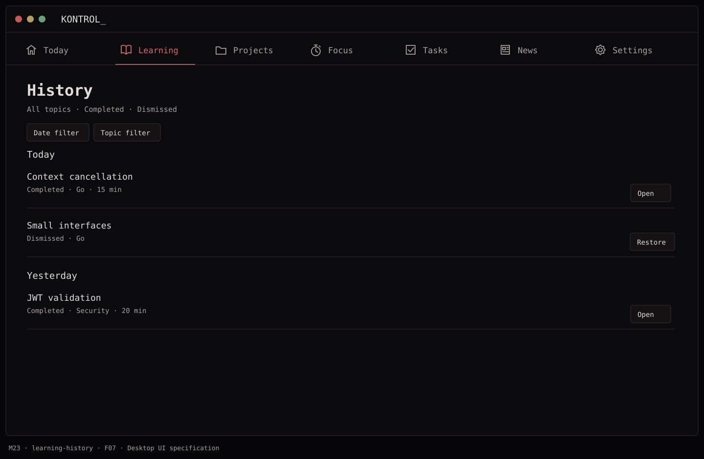
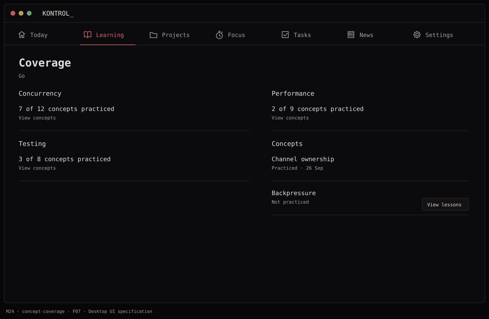

# F07 — Learning history, deduplication, and coverage

**Depends on:** F05, F06.

**Build**

- Store completed and dismissed lesson IDs permanently. History supports date and topic filters, a lesson detail view, and explicit distinction between `Completed` and `Dismissed`.
- Reject exact ID repeats; reject a matching normalized content fingerprint; reject candidates with the same primary objective and a high concept overlap against completed/dismissed content. Version edits to the same lesson keep the same stable ID.
- Choose from eligible seeded candidates using prerequisites, lower coverage subtopics, and stable tie-breaking. Four slots should be stable across launches and only change after completion, dismissal, or a catalog update.
- Show **coverage**, e.g. practiced concepts by subtopic and recent work, rather than a fake mastery percentage. Revisit/review is a separate, explicitly labeled future flow.

**Done when:** a renamed copy of a completed lesson is filtered by metadata, finishing one lesson rotates one slot, and history stays available after a catalog upgrade.

## Function → mockup contract

| Function / page | Dedicated visual | Expected behavior |
| --- | --- | --- |
| Filter and open history | [M23 · History](../mockups/M23-learning-history.png) | Filter by topic, date and status; retain the completed version snapshot. |
| Restore a dismissed lesson | [M23 · History](../mockups/M23-learning-history.png) | Remove its suppression only after the explicit Restore action. |
| Inspect coverage and concepts | [M24 · Coverage](../mockups/M24-concept-coverage.png) | Count distinct practiced concept ids; denominator comes from the versioned catalog. |
| Deduplicate and select replacement | [M21 · Learning](../mockups/M21-lesson-completion-rotation.png) | Expose the result through a changed slot; backend selection has no separate page. |

## Implementation checklist

- [ ] Use the deterministic matching/selection rules in architecture.md. Never ask AI to certify novelty.
- [ ] Store normalized content hash and objectiveKey alongside concept ids; log rejection reasons without answer text.
- [ ] Count each concept once for coverage, regardless of repeated reading; avoid a mastery claim.
- [ ] History details use the attempt snapshot so later content edits do not rewrite what was studied.
- [ ] Keep all completed history indefinitely in V1; dismissal can be restored but completion is not silently erased.

## Non-interactive acceptance checks

Follow [AGENTS.md](../../AGENTS.md). Test domain projections and persistence with isolated fixtures; review UI wiring in source. No accessibility, native keyboard, hosted UI or live-app checks are required.

- [ ] Title-only renaming with the same objective is rejected.
- [ ] Different objectives on the same concept can be eligible if not an exact duplicate.
- [ ] Coverage and historical snapshots survive a catalog version change.

## Visual references

[Back to PLAN](../../PLAN.md) · [All screens](../mockups/INDEX.md) · [Data contracts](../architecture.md)
