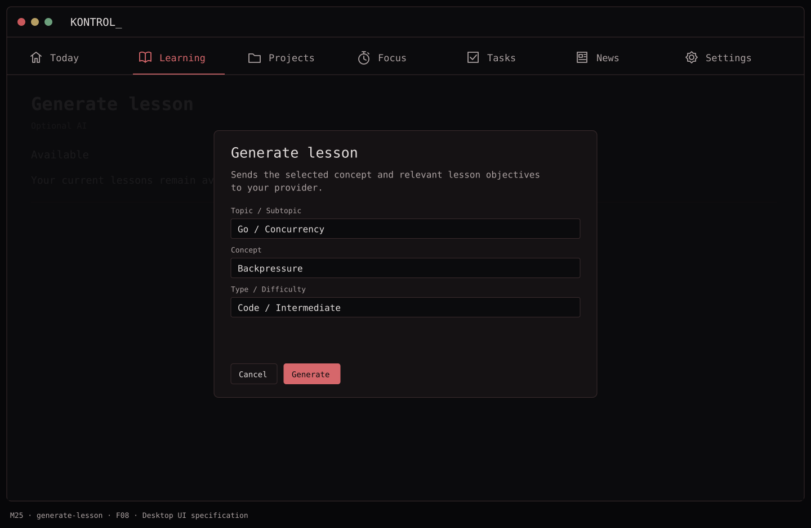
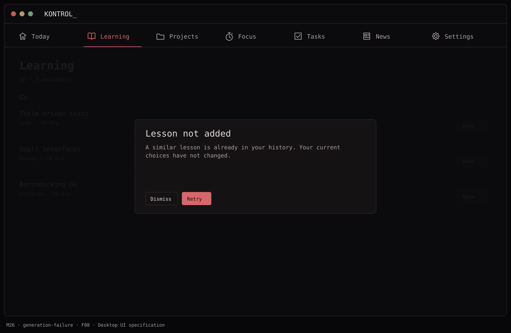
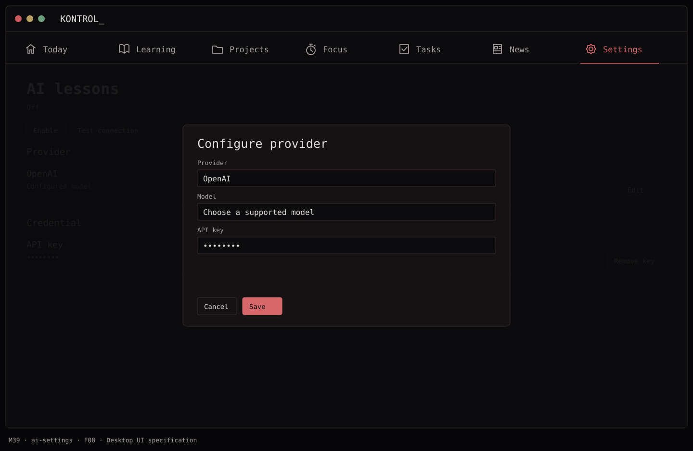

# F08 — Optional AI lesson expansion

**Depends on:** F05–F07. This completes the agreed hybrid curriculum; it must never block the seeded offline flow.

**Build**

- Define `LessonGenerator.generate(request) -> CandidateLesson`; implement one configurable provider behind that interface. Store a user-supplied credential in Keychain, with clear disable/remove controls in Settings.
- Request a specific topic/subtopic/concept/difficulty/type; provide relevant completed concept IDs and objectives, not the entire personal history. Validate structured output, required exercise/solution, allowed concept IDs, length, and duplicate checks before saving locally.
- Generate only on an explicit action or when a topic's eligible seeded pool is exhausted and the user opts in. If generation fails or is unavailable, leave the current choices and explain why; do not silently replace a lesson.
- Save generated content and provenance locally so opening it later works offline. No AI grading in V1.

**Done when:** an opted-in user can add a valid unseen lesson, invalid/duplicate output is discarded, and the learning area still works with no provider or network.

## Function → mockup contract

| Function / page | Dedicated visual | Expected behavior |
| --- | --- | --- |
| Configure, enable, test or remove provider key | [M39 · AI lessons](../mockups/M39-ai-settings.png) | Use Keychain; do not echo the credential in logs or exports. |
| Generate a candidate | [M25 · Generate lesson](../mockups/M25-generate-lesson.png) | Explicit action shows request scope; cancel leaves existing slots alone. |
| Handle invalid, duplicate or failed generation | [M26 · Learning](../mockups/M26-generation-failure.png) | Do not persist invalid output; retain existing choices and offer bounded retry. |

## Implementation checklist

- [ ] Implement one initial OpenAI adapter behind LessonGenerator. Verify current official endpoint/model and structured-output documentation when implementing; model ids are configuration, not app-domain constants.
- [ ] Use Keychain references in settings and request timeouts; show configuration errors before submitting a request.
- [ ] Validate topic, objective, concept IDs, type, duration, content sections and normalized duplicate checks.
- [ ] Maximum one request per user action; at most one automatic repair retry for invalid structure, then an actionable error.
- [ ] Persist accepted lesson definitions and provenance locally. Send only relevant concept/objective metadata, not task/project contents or lesson answers.

## Non-interactive acceptance checks

Follow [AGENTS.md](../../AGENTS.md). Use injected generator/network/credential adapters and isolated repository tests. Do not drive Settings or submit live paid generation for validation; no accessibility, keyboard or hosted UI gate is required.

- [ ] No-key and offline states never disable seeded learning.
- [ ] A duplicate or malformed result produces M26 and leaves slots unchanged.
- [ ] Removing the key prevents future generation and removes it from Keychain.

## Visual references

[Back to PLAN](../../PLAN.md) · [All screens](../mockups/INDEX.md) · [Data contracts](../architecture.md)
