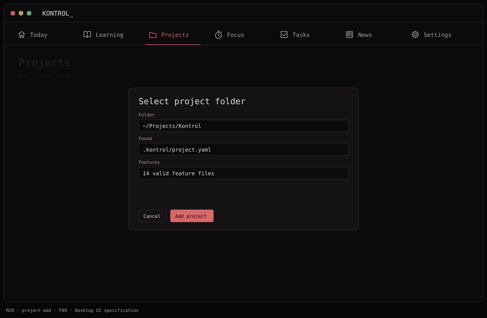
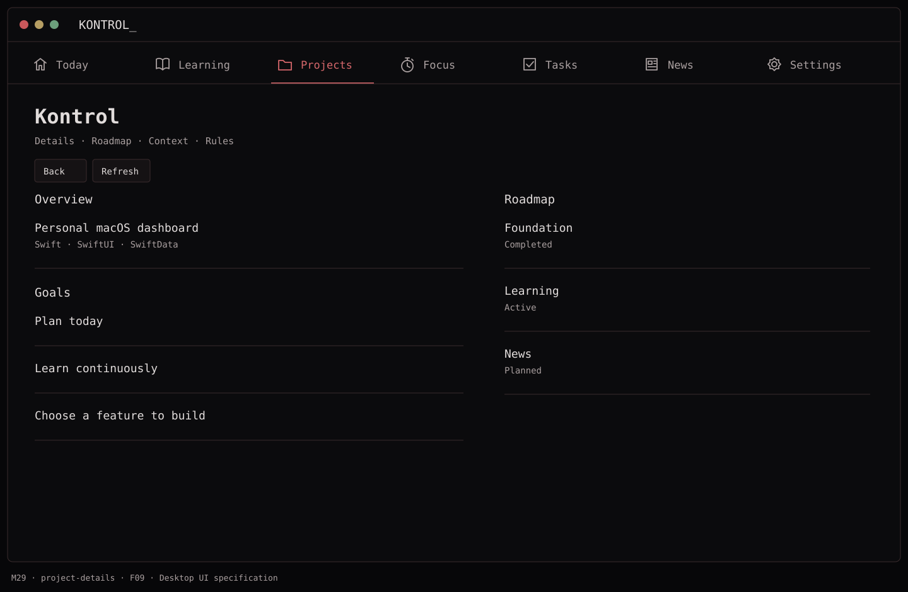
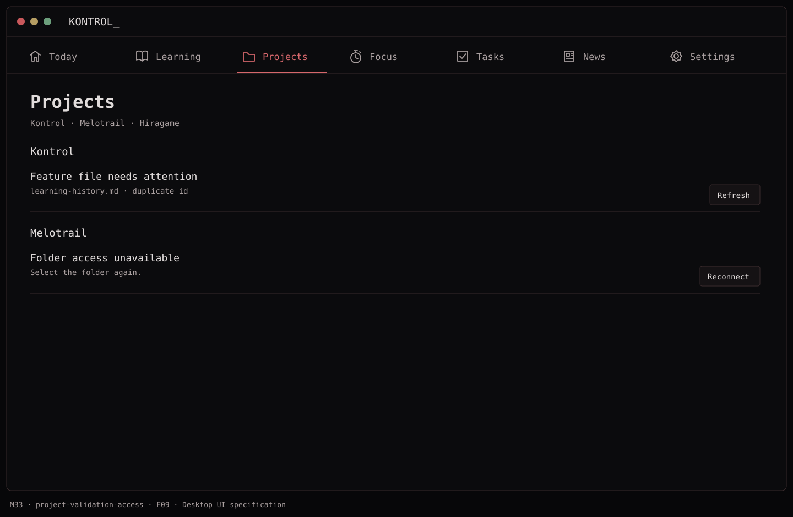

# F09 — Add and inspect a local project

**Depends on:** F00, F01.

**Build**

- Select a folder, create a persistent security-scoped bookmark, and show project name, description, stack, goals, current focus, roadmap milestones, and feature completion count from `.kontrol`.
- Parse and validate `project.yaml`, `roadmap.yaml`, `features/*.md`. Display `context.md` and `rules.md` as optional read-only project notes. `history.yaml` may be shown when present; it is not a second status store in V1.
- Re-read on window activation or manual Refresh; never execute content from the project. Offer actionable errors for a missing `.kontrol`, duplicate IDs, malformed frontmatter, unreadable files, moved folder, and stale bookmark. Other projects remain usable if one fails.
- Store only the folder bookmark and local display preferences in SwiftData. The project files are the source of truth.

**Done when:** adding two local folders works, both reopen after relaunch, and a missing/malformed file has an understandable recovery path.

### `.kontrol` V1 contract

```text
project-root/
  .kontrol/
    project.yaml       # required
    roadmap.yaml       # optional but recommended
    context.md         # optional, read-only
    rules.md           # optional, read-only
    history.yaml       # optional, read-only in V1
    features/
      <feature-id>.md  # zero or more, frontmatter + Markdown body
```

```yaml
# .kontrol/project.yaml
schema_version: 1
id: melotrail
name: Melotrail
description: Local music creation app
stack: [Kotlin, Python]
goals:
  - Improve the quality of generated songs
current_focus: [arrangement]
```

```yaml
# .kontrol/roadmap.yaml
schema_version: 1
milestones:
  - id: core
    title: Core pipeline
    status: completed
  - id: arrangement
    title: Better arrangement
    status: active
```

```md
---
id: transitions
title: Smooth section transitions
status: ready
priority: high
effort: medium
depends_on: [structure]
areas: [arrangement]
completed_at:
---

Create musical transitions between arranged sections.

Acceptance:
- Keep the source melody recognizable.
- Avoid abrupt changes in rhythm and instrumentation.
```

Allowed feature states are `planned`, `ready`, `active`, `blocked`, `completed`; priority is `high`, `medium`, or `low`; effort is `small`, `medium`, or `large`. IDs are stable and unique within the project. A `depends_on` ID must exist in the same project. Unknown fields are preserved. Files with unsupported `schema_version` remain readable as raw text with a clear upgrade message, never rewritten blindly.

## Function → mockup contract

| Function / page | Dedicated visual | Expected behavior |
| --- | --- | --- |
| Add a project folder | [M28 · Projects](../mockups/M28-project-add.png) | Use a native folder picker, validate before saving the bookmark. |
| Read project details, roadmap, context and rules | [M29 · Kontrol](../mockups/M29-project-details.png) | Read-only project metadata; only completion writes a feature file. |
| Refresh, validate or reconnect | [M33 · Projects](../mockups/M33-project-validation-access.png) | Show per-file errors; one bad project does not break other projects. |

## Implementation checklist

- [ ] Implement ProjectFolderAccess with scoped bookmark lifetime and selected read/write entitlement.
- [ ] Resolve paths and reject feature files that escape the selected root through traversal or symlinks.
- [ ] Use Yams for validation and a small frontmatter patcher for status writes; do not serialize whole files for a single status update.
- [ ] Reject duplicate ids, dependency cycles, missing dependency ids and unsupported schema versions; show file names and reasons.
- [ ] Keep metadata snapshots in memory; persist bookmarks and optional last-good display cache only. Disk remains authoritative.

## Non-interactive acceptance checks

Follow [AGENTS.md](../../AGENTS.md). Use disposable folders, injected grants and repository/store tests. Review picker wiring in source; no real picker, app relaunch, accessibility, keyboard or hosted UI check is required.

- [ ] Reopened references resolve through the injected folder-access adapter.
- [ ] Two folders with different project ids remain independently accessible.
- [ ] Stale access can reconnect without duplicating the project; malformed files produce M33.

## Visual references







[Back to PLAN](../../PLAN.md) · [All screens](../mockups/INDEX.md) · [Data contracts](../architecture.md)
