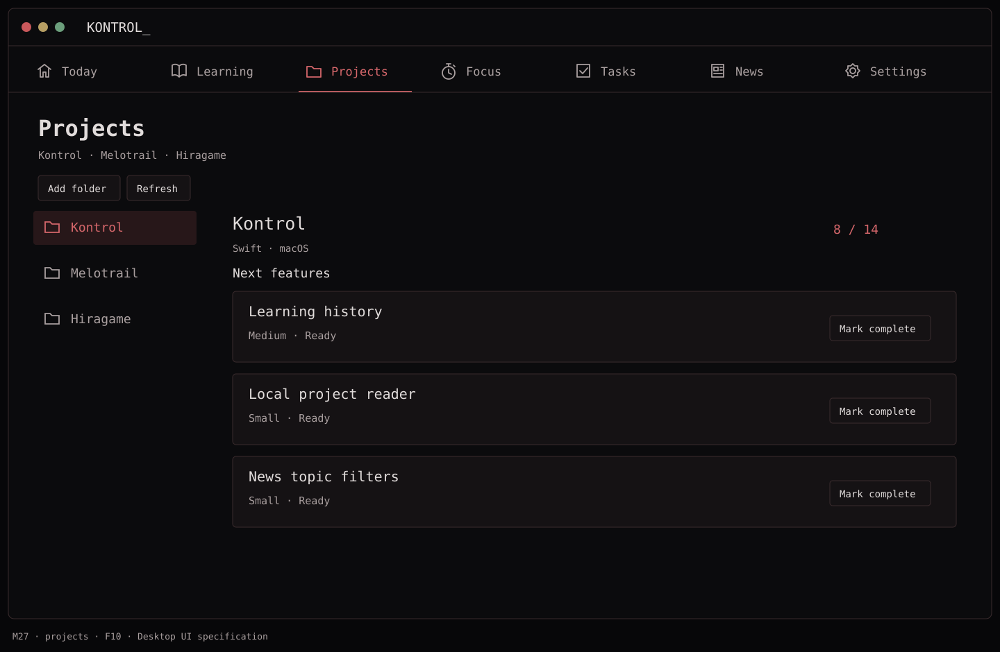
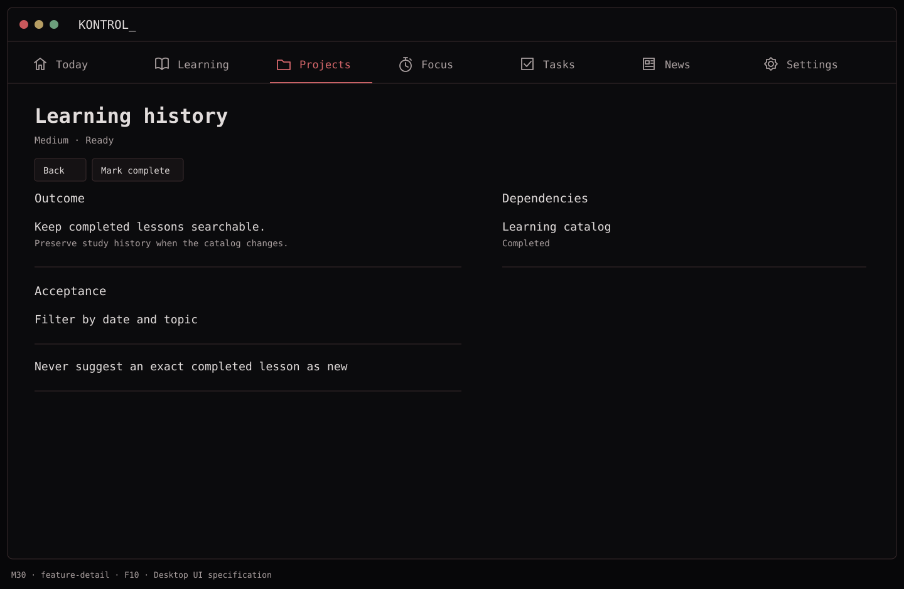
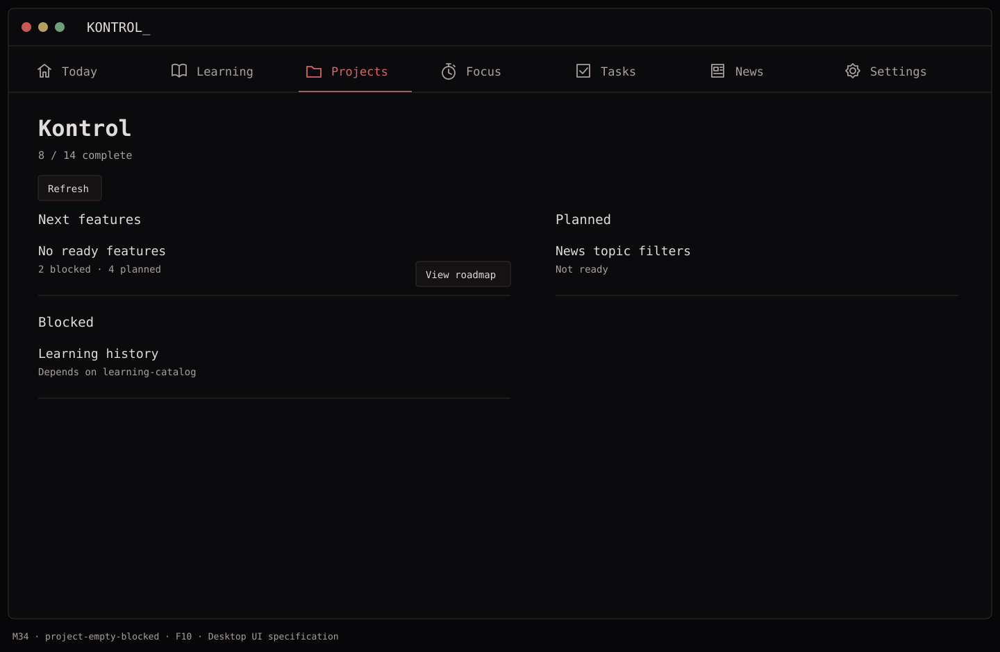

# F10 — Next-feature cards

**Depends on:** F09.

**Build**

- Show up to **three** eligible cards for the selected local project. Eligible means `ready`, every dependency completed, and no explicit blocker. `planned` work stays in the roadmap until its file is explicitly made ready; completed and active work do not appear as next-feature candidates.
- Sort deterministically: current-focus area before others, then priority, effort (smaller first), and stable ID. Display a short reason: e.g. `Ready · dependency complete` or `Matches current focus`.
- Show the full feature description and acceptance notes on selection. If no feature is eligible, explain whether all are complete or dependencies/blockers prevent suggestions.
- Keep the candidate algorithm local. AI and GitHub do not invent roadmap items in V1.

**Done when:** identical files yield identical cards, changing dependency statuses updates eligibility, and a cycle or missing dependency becomes a validation error rather than a misleading card.

## Function → mockup contract

| Function / page | Dedicated visual | Expected behavior |
| --- | --- | --- |
| Choose a project and next feature card | [M27 · Projects](../mockups/M27-projects.png) | Show up to three deterministic ready candidates. |
| Read full feature details | [M30 · Learning history](../mockups/M30-feature-detail.png) | Show requirements, dependencies and acceptance text from the file. |
| No eligible features or all complete | [M34 · Kontrol](../mockups/M34-project-empty-blocked.png) | Differentiate blocked/planned from complete; never invent extra cards. |

## Implementation checklist

- [ ] Filter status=ready, all dependencies completed, and schema-valid items.
- [ ] Sort by current-focus match, priority high→low, effort small→large, stable id.
- [ ] Compute completion numerator from status=completed, denominator from valid feature records; clearly flag excluded invalid records.
- [ ] Preserve selected project and feature id across refresh; close missing detail views with a clear message.
- [ ] Keep planned, blocked and active work visible in the read-only roadmap/detail list without making it eligible.

## Acceptance checks

- [ ] The same source files yield the same three cards across relaunch.
- [ ] Completing a dependency makes a ready downstream feature eligible.
- [ ] All-complete and all-blocked states have different labels.

## Visual references

[Back to PLAN](../../PLAN.md) · [All screens](../mockups/INDEX.md) · [Data contracts](../architecture.md)
