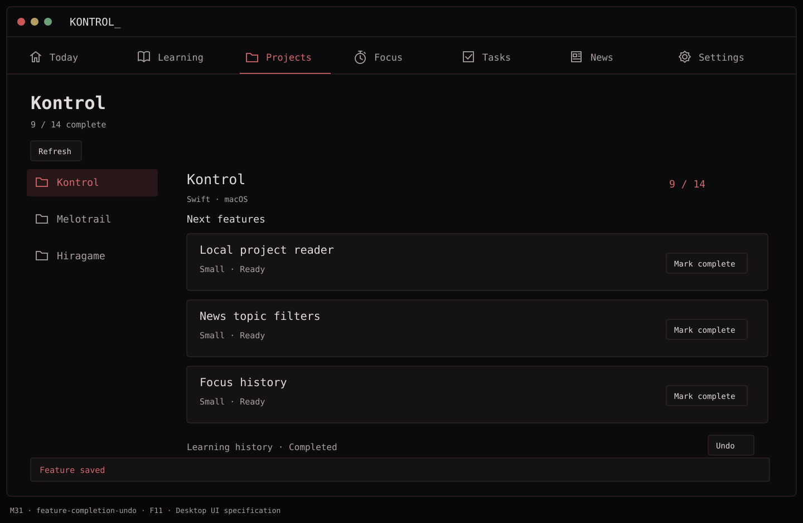
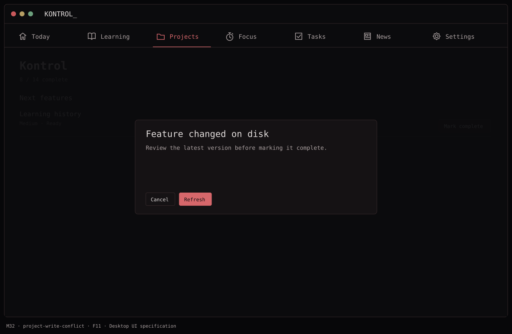

# F11 — Complete a project feature

**Depends on:** F09, F10.

**Build**

- A visible `Mark complete` action changes the selected feature file's frontmatter `status` to `completed` and adds `completed_at` in ISO 8601 UTC. It updates only that file; preserve its body, comments, unknown frontmatter fields, and newline style.
- Read the file immediately before writing, detect an external edit since the card was loaded, and ask to refresh rather than overwrite it. Use coordinated, atomic replacement in the selected folder; show a failure without claiming completion if the write fails.
- Refresh progress and next-feature cards after success. Provide an `Undo` action that restores the previous status and removes `completed_at` when appropriate.
- Never edit source code, roadmap, git state, or GitHub as a side effect.

**Done when:** the on-disk Markdown change is minimal and reviewable, downstream features become eligible, undo works, and conflicting external edits are never lost.

## Function → mockup contract

| Function / page | Dedicated visual | Expected behavior |
| --- | --- | --- |
| Mark feature complete and update cards | [M31 · Kontrol](../mockups/M31-feature-completion-undo.png) | Persist to its Markdown frontmatter before showing success. |
| Undo completion | [M31 · Kontrol](../mockups/M31-feature-completion-undo.png) | Restore the immediately previous status only if the saved revision still matches. |
| Recover from conflict or write failure | [M32 · Kontrol](../mockups/M32-project-write-conflict.png) · [F11 supplemental states](../../.mockups/flows/f11-feature-completion/index.html) | Refresh rather than overwriting a changed file; no optimistic success. |

## Implementation checklist

- [ ] Capture source digest when reading a feature. Re-read and compare digest inside a coordinated write.
- [ ] Patch only top-level status and completed_at scalar ranges; preserve unknown keys, comments, body and line endings. If safe patching is impossible, fail visibly.
- [ ] Write a sibling temporary file, validate resulting YAML, replace atomically, then reread and update the view.
- [ ] Store a short-lived undo patch plus post-write digest; refuse undo if another editor has changed the file.
- [ ] Serialize writes per project. Do not update history.yaml, roadmap, code or Git.

## Non-interactive acceptance checks

Follow [AGENTS.md](../../AGENTS.md). Call completion services directly against disposable file fixtures with injected grants/failures. No running-app, accessibility, keyboard or hosted UI validation is required.

- [ ] Byte diff contains only intended frontmatter changes.
- [ ] A conflicting external edit remains intact and produces M32.
- [ ] Permission failure, disk failure or failed verification never increments completion count.

## Supplemental state references

[Open the F11 state map](../../.mockups/flows/f11-feature-completion/index.html) for linked Projects-workspace previews: [Saving / Undoing](../../.mockups/flows/f11-feature-completion/01-saving.html), [write failure](../../.mockups/flows/f11-feature-completion/02-write-failure.html), [undo conflict](../../.mockups/flows/f11-feature-completion/03-undo-conflict.html), [expired Undo](../../.mockups/flows/f11-feature-completion/04-undo-expired.html), [unpatchable source](../../.mockups/flows/f11-feature-completion/05-unpatchable-source.html), and [verified save with failed refresh](../../.mockups/flows/f11-feature-completion/06-saved-refresh-failed.html). These extend M31/M32 rather than replacing their approved layout. Conflict Refresh only reads the latest version for review; it does not automatically retry a write. Reconnect addresses a lost folder grant, not an edit conflict. Failures do not manufacture a new Undo or completion count; if verification is uncertain, show stale/unverified rather than “not saved.” Example names and counts are illustrative. These HTML pages are **static guidance, not native acceptance**; rendered, interactive, accessibility and live signed-sandbox validation are not required or deferred to F13.

## Visual references

[Back to PLAN](../../PLAN.md) · [All screens](../mockups/INDEX.md) · [Data contracts](../architecture.md)
