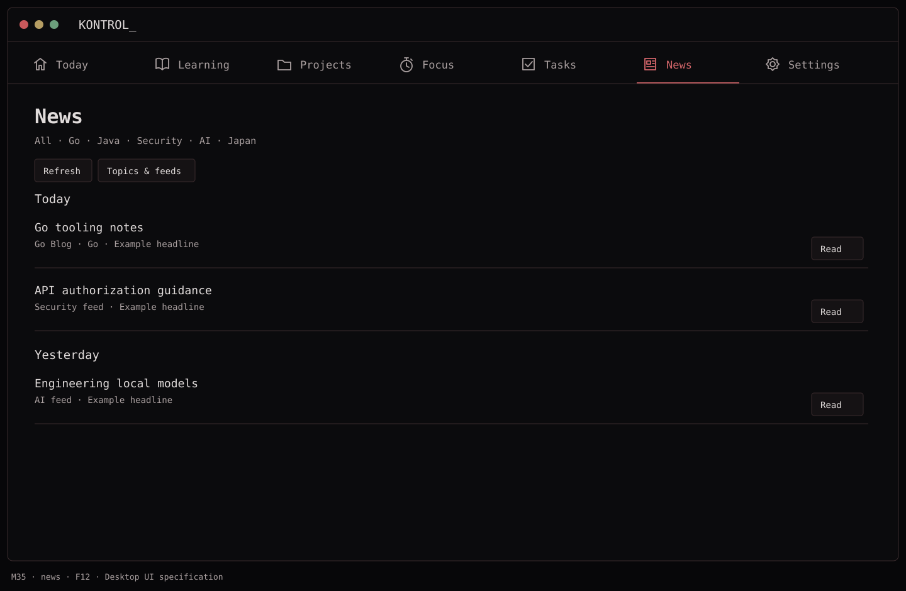
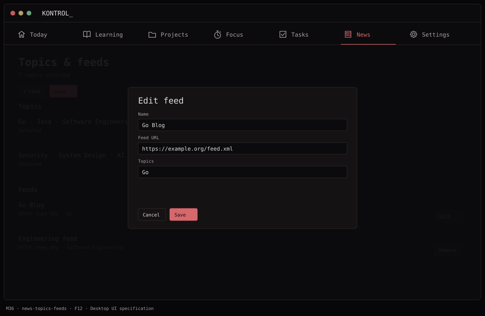
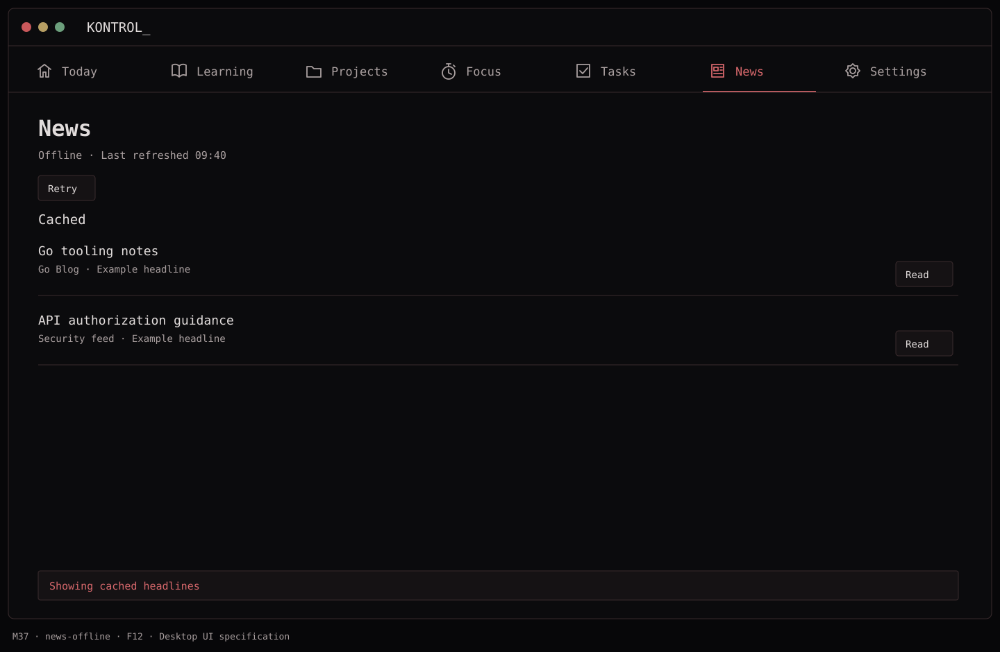

# F12 — Topic news

**Depends on:** F00, F01.

**Data:** `NewsTopic`, `FeedSource`, `ArticleMetadata(id, title, source, url, publishedAt?, summary?, topicIDs[])`, `lastRefreshAt`.

**Build**

- Provide a short curated, editable feed list by selected topic (initially Go, Java, Software Engineering, Security, System Design, AI, Japan; optional Gaming and Anime). One feed can map to multiple topics.
- Fetch RSS/Atom over HTTPS, parse metadata, deduplicate by canonical URL/feed GUID, and store a limited recent cache. Make parsing robust to missing dates and malformed items; bound refresh and storage.
- Show source, title, date, topic and a short feed-provided summary where present. `Read` opens the original HTTPS article in the default browser. No full-page extraction or embedded reader.
- Refresh manually and opportunistically with sensible rate limits. Offline/error state shows cached entries and last-refresh time.

**Done when:** topic selection changes the list, duplicate feed entries appear once, links open their source, and News remains usable from cache while offline.

## Function → mockup contract

| Function / page | Dedicated visual | Expected behavior |
| --- | --- | --- |
| Filter topics, refresh and read at source | [M35 · News](../mockups/M35-news.png) | Fetch metadata and open validated HTTP(S) article links in the browser. |
| Select topics and add/edit/remove feed | [M36 · Topics & feeds](../mockups/M36-news-topics-feeds.png) | Persist feed preferences; validate a feed before enabling it. |
| Offline, stale or failed refresh | [M37 · News](../mockups/M37-news-offline.png) | Keep cached entries, show last success time, and allow retry. |

## Implementation checklist

- [ ] Implement FeedFetcher and RSS/Atom metadata parser with external entities disabled. Limit response size to 2 MB and request time to 15 seconds.
- [ ] Use feed GUID with feed id when reliable, otherwise normalized article URL; preserve query parameters unless recognized tracking-only.
- [ ] Deduplicate across feeds by normalized URL; allow one article to have multiple selected topics.
- [ ] Refresh manually or after 30 minutes stale while foregrounded; use ETag/Last-Modified, at most 4 concurrent fetches, no background daemon.
- [ ] Retain 30 days or 500 articles, whichever is smaller. Render summaries as plain text and keep them collapsed by default.

## Acceptance checks

- [ ] One malformed feed does not discard another feed's results.
- [ ] Repeated refresh does not duplicate articles; missing dates are labeled, not fabricated.
- [ ] Offline launch shows cached content and safe links remain available.

## Visual references

[Back to PLAN](../../PLAN.md) · [All screens](../mockups/INDEX.md) · [Data contracts](../architecture.md)
