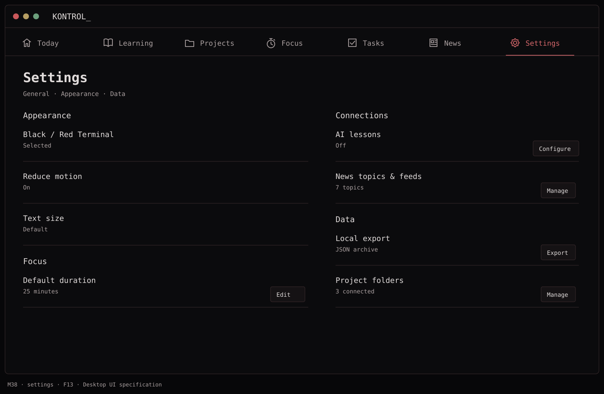
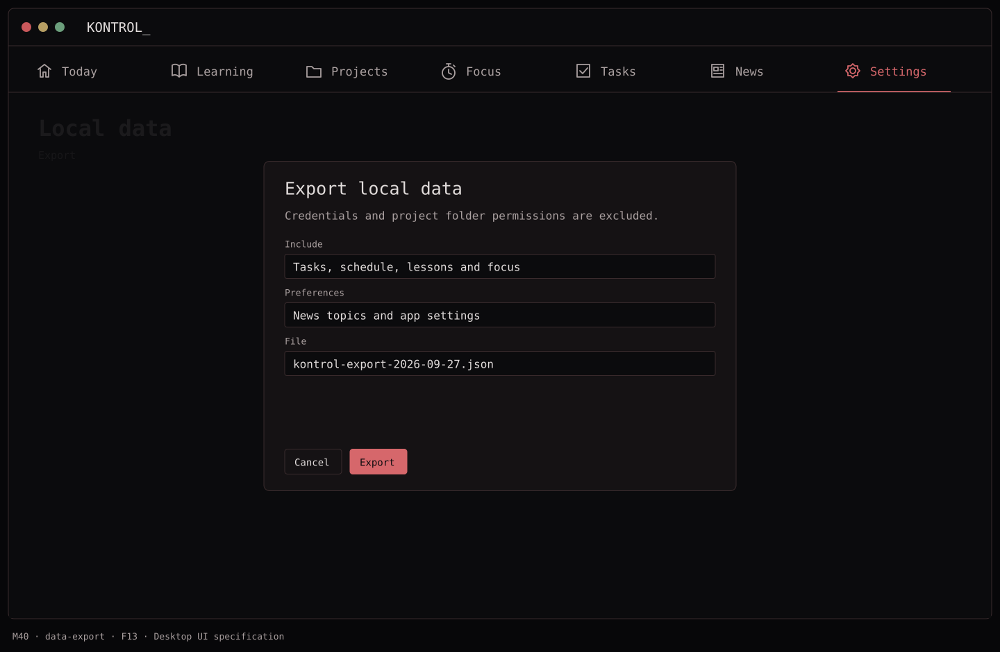
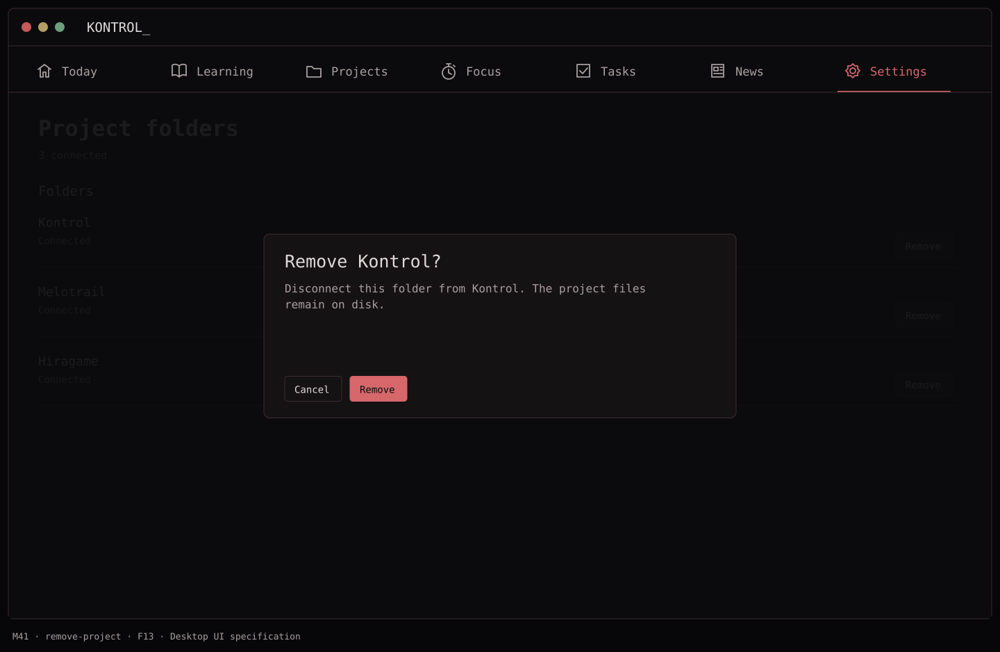
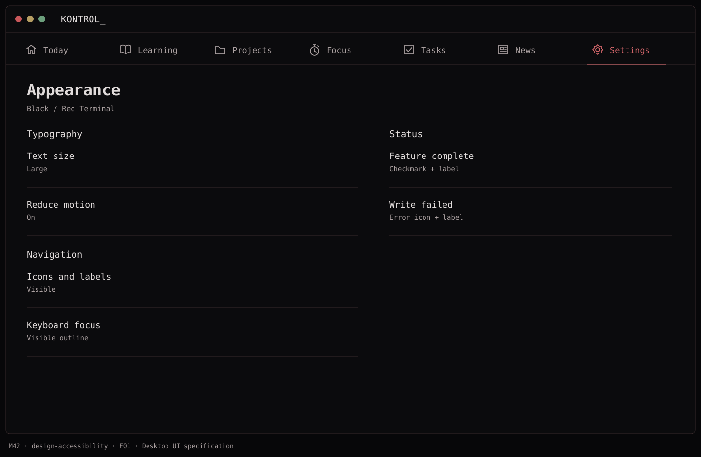

# F13 — Settings, accessibility, and V1 release

**Depends on:** all previous features. **Current status:** Settings/export and
release preparation implemented; non-GUI integration and distribution verification
follow root `AGENTS.md` and [QA](../qa.md). Dated results and historical failures/skips remain in [QA](../qa.md).
This is an executable app, not just a specification package; implementation
verification is not unconditional F13/V1 completion.

## Implemented behavior

- Main-window and native Command-comma Settings use the same `AppDependencies`
  container, existing feature stores and one transient export service. General,
  AI/Keychain, News, Projects and Learning answers remain separate state owners;
  navigation, editor drafts/revision baselines, confirmations and focus are
  per-client presentation state. Shared publications do not overwrite drafts.
- General preferences are typed/versioned: default 25 minutes, 15/25/50 presets
  or positive whole custom minutes, system/large text and system/reduced motion.
  Changes affect following ready Focus drafts, never existing sessions or frozen
  submitted retries. Missing storage supplies defaults without insertion;
  unreadable storage is not absence. Reduced motion combines system OR app;
  Large respects larger system sizes and avoids duplicate scaling. Black / Red
  Terminal is fixed, not a theme picker.
- AI, News and folder management reuse existing owners and screens. Opening
  Settings does not generate lessons or refresh feeds. Core saved daily/Learning
  loops and authorized local projects work without network/account; cached News
  stays available offline, while explicit refresh and optional AI need network.
- Folder listing/review/removal reads local references only. Remove captures
  name/ID/revision and disconnects durably before clearing that reference's
  transient state; it never accesses/deletes/edits external `.kontrol`, source or
  Git files. Stale/missing targets need explicit reload/review/reconfirmation;
  busy operations reject removal. Add/Reconnect reuse native authorization.
- Local Data exports [version-1 plain JSON](../export-format.md): tasks, blocks,
  all persisted Focus states, stored Learning taxonomy/accepted definitions,
  progress, exact saved answers/attempt milestones and available historical
  content, slots, terminal evidence, catalog membership, effective News topics/
  feeds and General/nonsecret AI configuration. Legacy absence is explicit null,
  never substituted current content; included corruption aborts the whole export.
- Credentials **and references**, project grants/paths/contents, cached articles,
  transport/diagnostics and unsaved editor drafts are structurally excluded.
  Authored sensitive-looking notes/answers remain exact. Protect the JSON: no
  import/restore or encrypted backup is provided.
- Native JSON approval/replacement confirmation precedes cancellation checks,
  existing pending-answer flush and synchronous read-only capture. Picker cancel
  performs no flush/capture/artifact/write; failed answer saves retain pending
  answers and abort (earlier individual saves may remain). Private encoding and
  validation run off-main; coordinated atomic delivery preserves existing bytes
  on pre-commit failure/cancel and reports saved after commit despite late cancel.
  Destination grants are transient; owned staging is cleaned, with cleanup failure
  explicitly identified. Duplicate requests cannot overlap; retries are explicit.
- Version/build **1.0/1**, Release hardening and narrow unchanged permissions,
  packaged pinned-source [dependency notices](../third-party-notices.md), and
  [installation/update/signing procedures](../release.md) are implemented.
  Local store/sidecar preservation and separate Keychain/folder boundaries are
  documented in [architecture](../architecture.md). Local project authoring
  starts at [docs/examples/.kontrol](../examples/.kontrol/project.yaml).

## Function → mockup contract

| Function / page | Dedicated visual | Expected behavior |
| --- | --- | --- |
| Edit settings and Focus default | [M38 · Settings](../mockups/M38-settings.png) | Apply locally; existing sessions retain duration; independent drafts survive publication. |
| Export local data | [M40 · Local data](../mockups/M40-data-export.png) | Native JSON approval, saved-answer barrier and actual commit outcome; no credential/grant fields. |
| Disconnect project folder | [M41 · Project folders](../mockups/M41-remove-project.png) | Remove local reference only; leave every external project file unchanged. |
| Appearance preferences | [M42 · Appearance](../mockups/M42-design-accessibility.png) | Preserve existing text-size and reduced-motion behavior; no interactive validation required. |

[Supplemental decision/outcome/layout states](../../.mockups/flows/f13-settings-release/index.html)
cover the shared hub, General drafts, folders and export lifecycle. Compiled
geometry/focus fixtures do not establish native rendering or spoken observations.

## Implementation evidence versus required release gates

The independent checkpoints in QA cover preferences/Focus isolation, revision-safe
local disconnect/callback fencing/external-byte preservation, export DTO/projections/
capture/IO/lifecycle/ownership, Settings routing and compiled adaptive/focus fixtures.
Step 5.1 explains and repairs the F11 mutable generated-store snapshot test boundary,
with rich V9→V10/reopen/repeat evidence and unchanged original fixture inventories;
the historical failed run remains recorded. Ten schemas/nine stages are preserved.
Steps 5.2–5.4 record metadata, hardening, resource/notice and executable-runbook
verification, not signed/native distribution approval. Step 5.5 records fresh
export test/JSON/link checks. Consolidated implementation integration remains next.

**Required validation is non-interactive only:**

- Build the app, compile all tests, run static analysis and explicitly selected non-GUI regression suites. Validate persistence and migration with isolated repository reopen tests and injected dependencies.
- Inspect Release resources, metadata, entitlements and signatures without launching the app. No debugging entitlement or Debug recovery injection is allowed in Release.
- For distribution, retain authorized Developer ID/team/notary inputs, accepted-only notarization, staple/Gatekeeper assessment, ZIP/checksum/extraction and repeat static artifact verification. Ad-hoc/unsigned packaging is not distribution approval.

A13 accessibility/keyboard/hosted checks, S13 live sandbox journeys and B13 interactive runtime checks are removed, not deferred. No screenshots, physical/synthetic input, native dialogs, desktop reservation or app launch is required for validation. Product behavior is unchanged. Preserve historical results without converting excluded checks into passes; investigate non-GUI failures and missing signing credentials within their remaining scope. See [release.md](../release.md) for current commands.

## Visual references

[Back to PLAN](../../PLAN.md) · [All screens](../mockups/INDEX.md) · [Data contracts](../architecture.md)
